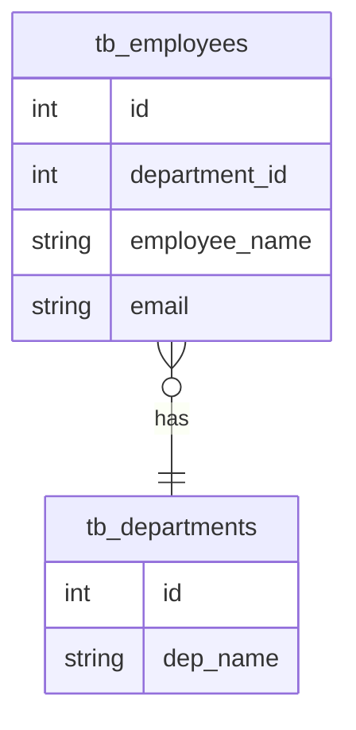
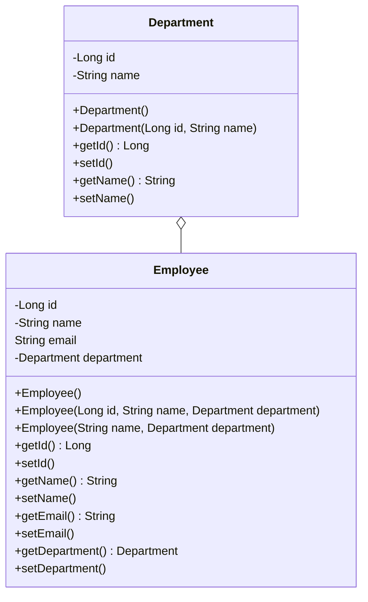

# RESTful API
This application offer in a web url, informations of a department and the employees of each department. It uses the following frameworks:
<ul>
 <li>Java Spring Boot: To create, and run the API;</li>
 <li>Java Persistence Annotation: To do the database manipulation;</li>
 <li>Lombok: To facilitates the creation of common codes (getters, setters).</li>
</ul>
It uses MySQL as the Database Management System.
## Modeling
The application uses the Java Persistence Annotation to do the data base manipulation, the following UML Diagrams describe the classes structure and the database modeling.

### Entity Relationship Diagram
In the database scheme, the table "tb_employees" contains a stranger key row to refer the department primary key.

### Class Diagram
In class scheme, the department is represented as a class aggregated to the class Employee. To do this, an Department object is instantiated within the People object.

## How to run?

<ol>
	<li>To run this application, you need to open a MySQL connection in the port 3030 on your localhost and create a database called "restful_api_demo".</li>
	<li>Clone the project to your directory:  <code>git clone https://github.com/kdukoelho/demo-restful-api.git</code></li>
	<li>If you want, you can run the file import.sql located in <code>src/main/resources/import.sql</code> to populate the database.</li>
	<li>Now, run the DemoRestfulApiApplication.java, located in <code>src/main/java/com/rabbit/demorestfulapi/DemoRestfulApiApplication.java"</code></li>
</ol>

After that the API will be available in the URL: <b>http://localhost:8080/peoples</b>

## Operations

In this application, we can perform the CRUD operations employees table.

### CREATE
To insert an employee send a POST signal and pass in the body of the request in JSON format: the name, email, and department (As described in class diagram). Look at the following example: 
<pre><code>
{
	"peopleName": "Carlos Clério da Silva",
	"email": "carlos_clerio@yahoo.com.br",
	"department": {
		"id": 1,
		"depName": "Development"
	}
}
</code></pre>
If its work, the response will be the new employee data.
### READ

To read, there are two methods.
<ol>
	<li>GetEmployeeList: Just send a GET signal to http://localhost:8080, this will return the data of tb_employees in JSON format.</li>
	<li>GetEmployeeById: Send a GET signal to http://localhost:8080/{id}, this will return the data of the referred id located in tb_employees.</li>
</ol>

### UPDATE
To update a employee, send a POST signal to http://localhost:8080/{id}, where the id is the identification of the desire employee, and pass in the body of the request in JSON format: the name, email, and department. If its work, the response will be the employee new data.

### DELETE

To delete an employee, send a DELETE signal to http://localhost:8080/{id}, where the id is the identification of the desire employee. If its work, the response will be a string confirming that.

