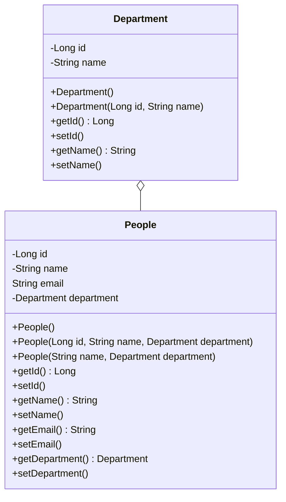

# RESTful API
This application offer in a web url, informations of a department and the employees of each department. It uses the following frameworks:
<ul>
 <li>Java Spring Boot: To create, and run the API;</li>
 <li>Java Persistence Annotation: To do the database manipulation;</li>
 <li>Lombok: To facilitates the creation of common codes (getters, setters).</li>
</ul>
It uses MySQL as the Database Management System.
## Modeling
The application uses the Java Persistence Annotation to do the data base manipulation, the following UML Diagrams describe the classes structure and the database modeling.

### Entity Relationship Diagram
In the database scheme, the table "tb_peoples" contains a field to store the primary key of the "tb_departments".

```mermaid
erDiagram
tb_peoples ||--|{ tb_departments : contains
   tb_peoples {
       int id
       int department_id
       string people_name
       string email
   }
	tb_departments {
		int id
		string dep_name
	}
}
```

### Class Diagram
In class scheme, the department is represented as a class aggregated to the class of People. To do this, an Department object is instantiated within the People object.



## How to run?

<ol>
	<li>To run this application, you need to open a MySQL connection in the port 3030 on your localhost and create a database called "restful_api_demo".</li>
	<li>Clone the project using the following command: 
		<br> <code>git clone https://github.com/kdukoelho/demo-restful-api.git</code></li>
	<li>If you want, you can run the file import.sql located in <code>src/main/resources/import.sql</code>to populate the database.</li>
	<li>Now, run the DemoRestfulApiApplication.java, located in <code>src/main/java/com/rabbit/demorestfulapi/DemoRestfulApiApplication.java"</code></li>
</ol>
After that the API will be available in the URL: http://localhost:8080/peoples
