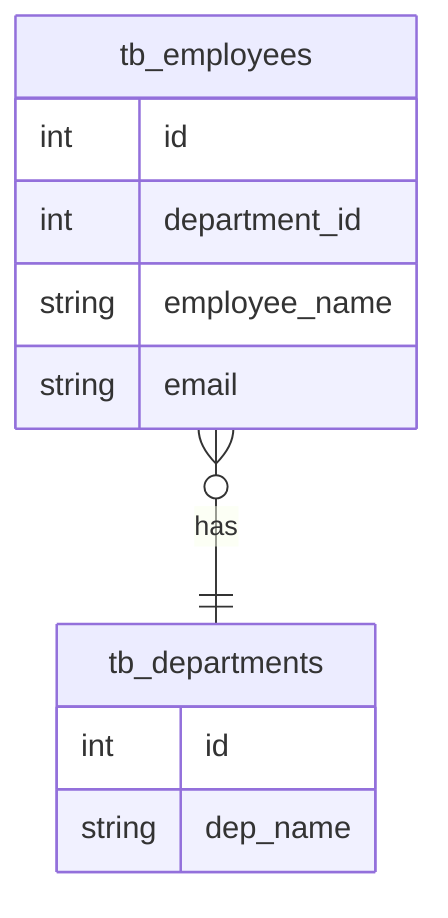
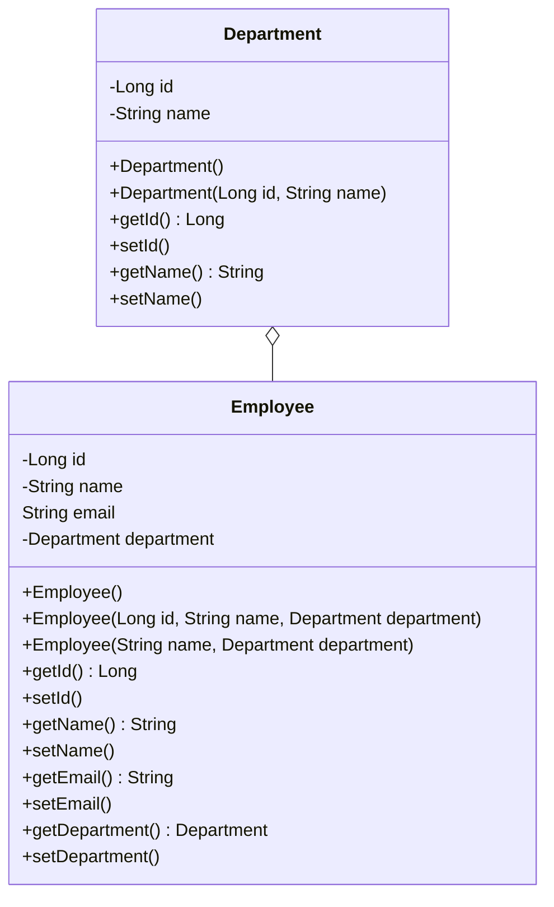

<h1 align="center"> Departments Managment API


</h1>

<p align="center">This application offer in a url (by default on http://localhost), data about company departments and yours employees.</p>

## 💻 Technologies

It uses the followings frameworks:

- Java Spring Boot
- Java Persistence Annotation
- Lombok

It uses MySQL as the Database Management System.

## Modeling
The application uses the Java Persistence Annotation to do the database manipulation and the Object-Relational Mapping (ORM), the following UML diagrams describe the classes structure and the database modeling.

#### Entity Relationship Diagram
In the database scheme, the table "tb_employees" contains a stranger key row to refer the department primary key.


#### Class Diagram
In class scheme, the department is represented as a class aggregated to the class Employee. To do this, an Department object is instantiated within the People object.



## 🚀 Setting up

### Prerequisites
1. You need to install MySQL and open a connection at port 3306 on your localhost, if everything works fines, the application will create a database called "todo-application";
2. Maven as path variable, or you can run the application directly on IDE.

### Cloning
1. Clone this repository on your machine:
```bash
git clone https://github.com/kdukoelho/departments-managment-api.git
```
2. Install the project dependencies:
```bash
mvn clean install
```
3. Run the application:
```bash
mvn spring-boot:run
```

## API Endpoints

### Employees

| Route                              | Description                                                    |
|------------------------------------|----------------------------------------------------------------|
| <kbd> POST /employees </kdb>       | Create a new employee                                          |
| <kbd> PUT /employees/{id}</kbd>    | Update the information's of the employee with the specified id |
| <kbd> GET /employees</kbd>         | Retrieves all users information                                |
| <kbd> GET /employees/{id}</kdb>    | Retrieves information of the user with the specified id        |
| <kbd> DELETE /employees/{id}</kbd> | Delete the user with the specified id                          |
 
#### POST /employees

**REQUEST**

```json
{
  "employeeName": "Carlos Clério da Silva",
  "email": "carlos_clerio@yahoo.com.br",
  "department": {
    "id": 1,
    "depName": "Development"
  }
}
```

**RESPONSE**

```json
{
  "id": 11,
  "peopleName": "Carlos Clério da Silva",
  "email": "carlos_clerio@yahoo.com.br",
  "department": {
    "id": 1,
    "depName": "Development"
  }
}
```

#### PUT /employees/{id}

**REQUEST**

```json
{
    "employeeName": "Julia Figueira",
    "email": "julinha123@gmail.com",
    "department": {
        "id": 1,
        "depName": "Development"
    }
}
```

**RESPONSE**

```json
{
  "id": 10,
  "peopleName": "Julia Figueira",
  "email": "julinha123@gmail.com",
  "department": {
    "id": 1,
    "depName": "Development"
  }
}
```

#### GET /employees

**RESPONSE**

```json
[
    {
        "id": 1,
        "peopleName": "Fernanda Agatha Lima",
        "email": "fernanda_lima@bds.com.br",
        "department": {
            "id": 1,
            "depName": "Development"
        }
    },
    {
        "id": 2,
        "peopleName": "Rafaela Yasmin da Rocha",
        "email": "rafaela_darocha@fosjc.unesp.br",
        "department": {
            "id": 3,
            "depName": "Humans Resources"
        }
    }
]
```

#### GET /employees/{id}

**RESPONSE**

```json
{
    "id": 2,
    "peopleName": "Rafaela Yasmin da Rocha",
    "email": "rafaela_darocha@fosjc.unesp.br",
    "department": {
        "id": 3,
        "depName": "Humans Resources"
    }
}
```

### Departments

| Route                                | Description                                                      |
|--------------------------------------|------------------------------------------------------------------|
| <kbd> POST /departments </kdb>       | Create a new department                                          |
| <kbd> PUT /departments/{id}</kbd>    | Update the information's of the department with the specified id |
| <kbd> GET /departments</kbd>         | Retrieves all departments information                            |
| <kbd> GET /departments/{id}</kdb>    | Retrieves information of the department with the specified id    |
| <kbd> DELETE /departments/{id}</kbd> | Delete the department with the specified id                      |

#### POST /departments

**REQUEST**

```json
{
    "name": "Marketing"
}
```

**RESPONSE**

```json
{
    "id": 4,
    "name": "Marketing"
}
```

#### PUT /departments/{id}

**REQUEST**

```json
{
    "name": "Countability"
}
```

**RESPONSE**

```json
{
    "id": 4,
    "name": "Countability"
}
```

#### GET /departments

**RESPONSE**

```json
[
    {
        "id": 1,
        "name": "Development"
    },
    {
        "id": 2,
        "name": "Marketing"
    },
    {
        "id": 3,
        "name": "Humans Resources"
    }
]
```

#### GET /departments/{id}

**RESPONSE**

```json
{
  "id": 2,
  "name": "Marketing"
}
```
